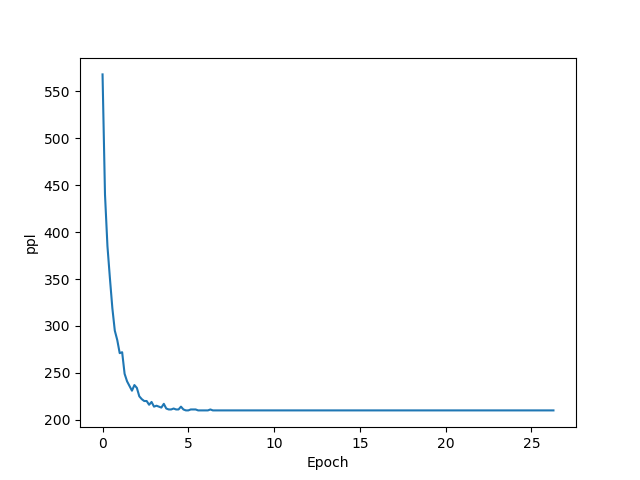

# MTProject
## 文件组织结构
  * RNN代码见文件夹-Codes
  * 课程报告见文件-2001889_周泽帆_机器翻译课程报告.pdf
  * 运行截图见文件夹-images
## 运行截图
  
  
  
## 主要工作
  * 编写了RNN语言模型代码，在PTB数据集上进行了分batch训练、验证。
  * 最终达到ppl值210
  * 训练过程如下图

  

## 课程建议
  1.可能对于IBM模型部分的介绍可以再简略一些，到后面感觉大家会有些更不上的情况；
  2.对于上机，除了复制命令行，体会整个训练解码过程之外，感觉可以再多一些自己调整程序的实践过程； 
  3.对于项目内容，感觉多一些对于简单模型的应用的题目吗，RNN，Seq2Seq，加Attention之类的。
